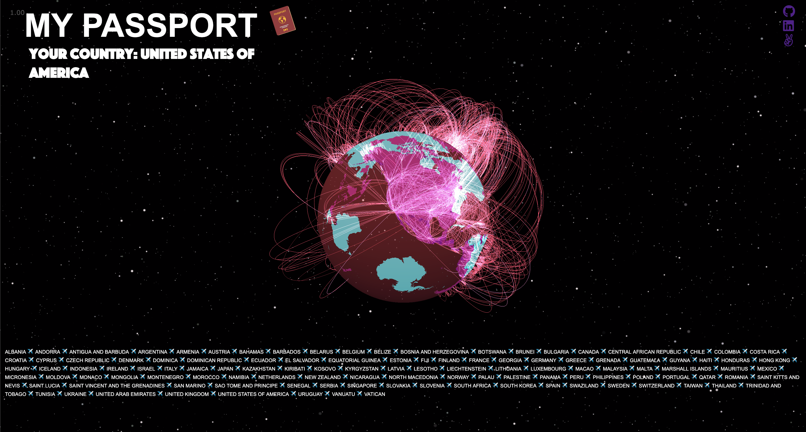

## README

### Live: [myPassport](https://dorotaaa.github.io/myPassport/ "myPassport")

### Overview 
myPassport is a WebGL visualization of which countries one can travel to 'openly' depending on which nation's passport they possess. 'Open countries' include countries that do not require a visa from a citizen of a given country, or offer visas upon arrival. For all other cases, including countries that require an approved visa prior to arrival are deemed ‘restricted’. The aforementioned information can be referenced at Visahq.co.uk and Passport Index.



#### Functionality 
Users can interact with the WebGL globe, by zooming in and out, rotating, and clicking on a country. On country-click the countries that allow visa-free travel will highlight purple. 

Each country is its own group, and therefore is 'drawn' with its own tetrahedral mesh calculated using drawThreeGeo and a Delaunator.

```javascript
    function drawMesh(group, x_values, y_values, z_values, triangles, color) {
        var geometry = new THREE.Geometry();
        for (let k = 0; k < x_values.length; k++) {
            geometry.vertices.push(
                new THREE.Vector3(x_values[k], y_values[k], z_values[k])
            );
        }

        for (let k = 0; k < triangles.length; k += 3) {
            geometry.faces.push(new THREE.Face3(triangles[k], triangles[k + 1], triangles[k + 2]));
        }

        geometry.computeVertexNormals()

        var mesh = new THREE.Mesh(geometry, new THREE.MeshBasicMaterial({
            side: THREE.DoubleSide,
            color: 0x00FFFF,
            wireframe: false,
            opacity: 1,
        }));
        clickableObjects.push(mesh);
        group.add(mesh);
        clearArrays();
    }
```
`onClick` functionality is made possible via a raycaster which finds the country on the WebGL globe based on the where the translated mouse coordinates (i.e. the mouse 'ray') intersects with country object on the globe.

```javascript

    const raycaster = new THREE.Raycaster();

    function onMouseClick(event) {

       updateMouseCoords(event, mouse);
        raycaster.setFromCamera(mouse, camera); {

            const intersects = raycaster.intersectObjects(clickableObjects);
                    if (intersects.length > 0) {
                    latestMouseProjection = intersects[0].point;
                    clickedObj = intersects[0].object;
                    setGroupColor(clickedObj.parent, 0x800080)
                }
            }
```
Airport (curve) coordinates and world coordinates are converted to sphere coordinates.

```javascript
    function convertToSphereCoords(coordinates_array, sphere_radius) {
        
        var lon = coordinates_array[0];
        var lat = coordinates_array[1];

        x_values.push(Math.cos(lat * Math.PI / 180) * Math.cos(lon * Math.PI / 180) * sphere_radius);

        y_values.push(Math.cos(lat * Math.PI / 180) * Math.sin(lon * Math.PI / 180) * sphere_radius);

        z_values.push(Math.sin(lat * Math.PI / 180) * sphere_radius);
    }
```

#### Technologies & Libraries 
`myPassport` is built solely vanilla Javascript and Javascript libraries including Three.js.